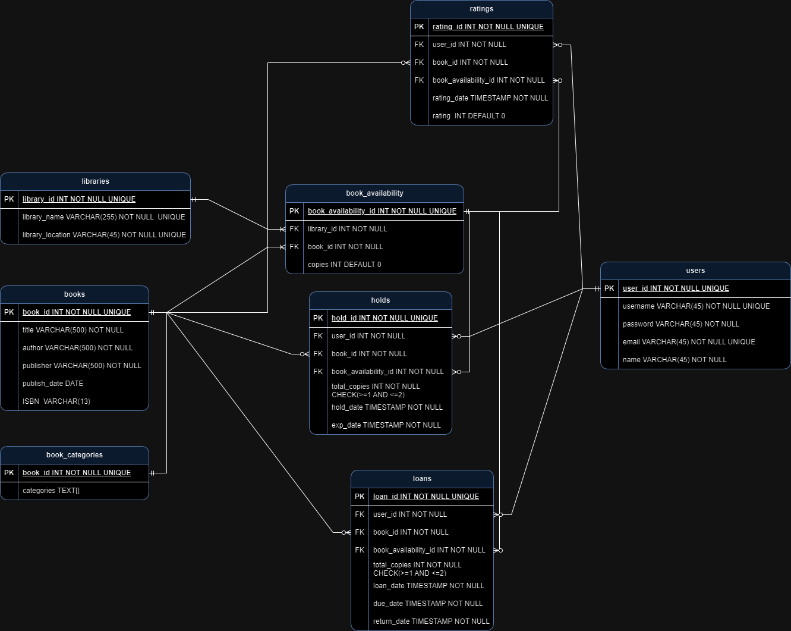

# E library Management System

SQL database implementation of e-library workflow

# Database Specification

* Purpose
* Business Rules
* Design Requirements
* Decision Design
* ERD diagram
* List of tables

## Database's Purpose

* To design and maintain books, multiple libraries, library members (users), loans, holding, and rating' books.
* It includes categories of books, where books are available, and the data privacy of users.
* As well as maintain books in different libraries.
* Reports are generated to visualize the data in a better manner.

## Business Rules

* Each library has a unique name.
* A book can be stored in multiple libraries.
* A book consist of title, author, publisher, publish date, category, and ISBN.
* A user consist of a unique username, a unique email, password, and name.
* Users can loan books from a library as long as the books are available.
* Users can loan a maximum of two books at a time.
* Users have 2 weeks to return books.
* Users who want to loan books but books are not available can hold books for one week.
* Users can hold a maximum of two books at a time.
* After users loan books, they can rate the books that they loaned.
* Loaners can rate books from 1 to 10.

# Design Requirements

* Using Crow' notation.
* Specify the primary key fields in each table by 'PK' beside the left the field.
* Specify the foreign key fields in each table by 'FK' beside the left the field.
* Drawing a line between the fields of each table and should be pointed directly to the fields in each table that are used to form the relationship.
* Specify a relationship as one or many by drawing a perpendicular line or a three-pronged line.
* Specify a relationship as mandatory or optional by drawing a perpendicular line or open circle.
* Each constraint was written beside each field.

# ERD Diagram

# List of tables

| List of tables | Description |
|------------|----------------------|
| libraries | This table stores libraries |
| books | This table stores book of libraries |
| book_categories | This table stores the categories of books |
| book_availability | This table stores the availability of books |
| users | This table stores of regiestered users |
| loans | This table stores record of loan of books |
| holds | This table stores record of hold of books |
| rating | This table stores rating of books |

